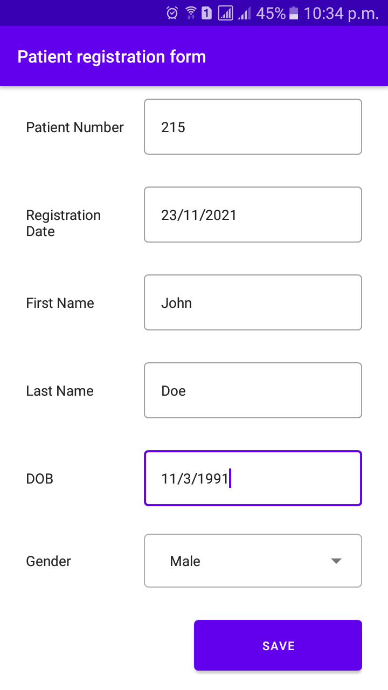
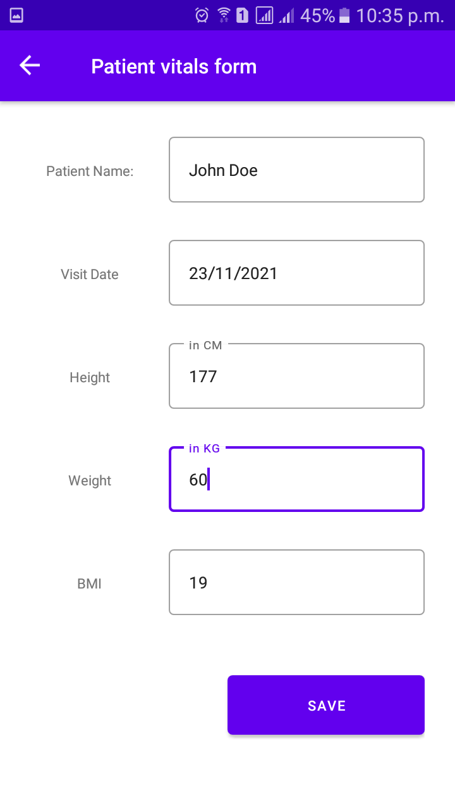
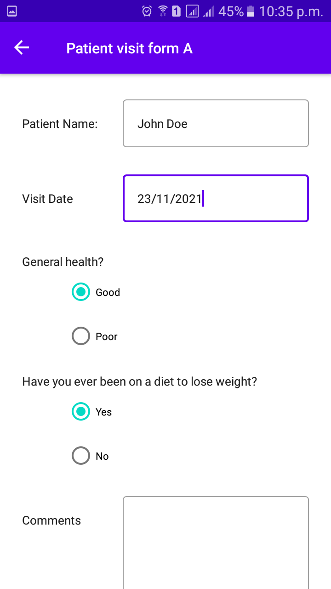

# HealthCareApp
An android application to register patients, take vitals, collect additional information via two custom forms and list the patient details.

## Screenshots

  
  
  

# Libraries

- [Android KTX](https://developer.android.com/kotlin/ktx) - Write more concise, idiomatic Kotlin code.
- Architecture components
    - [Lifecycles](https://developer.android.com/topic/libraries/architecture/lifecycle) - Create a UI that automatically responds to lifecycle events.
    - [LiveData](https://developer.android.com/topic/libraries/architecture/livedata) - Build data objects that notify views when the underlying database changes.
    - [ViewModel](https://developer.android.com/topic/libraries/architecture/viewmodel) - Store UI-related data that isn't destroyed on app rotations. Easily schedule asynchronous tasks for optimal execution.
- Third party libraries
    - [Hamcrest](http://hamcrest.org/) - for making assertion statements more readable.
    - [Timber](https://github.com/JakeWharton/timber) - a logging library for Android
